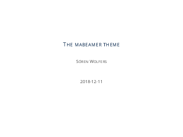
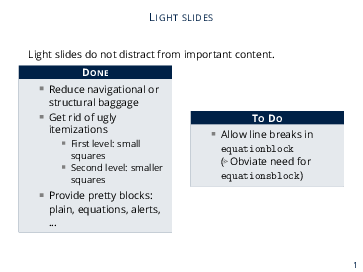
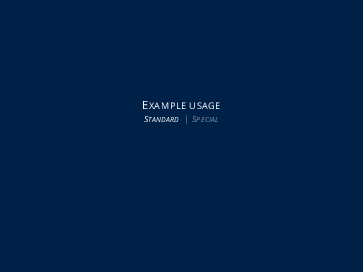
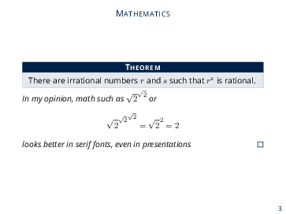
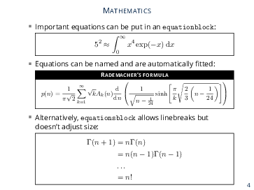
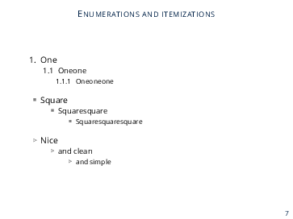

### What's this repository about? ###

* This repository contains a LaTeX beamer theme for pretty presentations on scientific topics
* Some example slides:

* This repository was inspired by other modern beamer themes: [freshroboto](https://github.com/sunzhida/freshroboto-beamer-theme) [metropolis](https://github.com/matze/mtheme) [HSRM](https://github.com/benjamin-weiss/hsrmbeamertheme) [bjeldbak](https://github.com/martinbjeldbak/beamertheme-bjeldbak)

### How do I use it? ###

* Download the file `beamerthememabeamer.sty` from this repository into your project directory
* Put the command `\usetheme{mabeamer}` in your preamble
* Check `_template/_template_mabeamer.tex` for example usage of the theme
* If you do not want to copy `beamerthememabeamer.sty` every time you create a new presentation, you may copy it into `<TEXMF>/tex/latex/beamer/base/themes/theme`. The value of `<TEXMF>` depends on your TeX distribution and your operating system, check out http://tex.stackexchange.com/questions/1137/where-do-i-place-my-own-sty-or-cls-files-to-make-them-available-to-all-my-te
