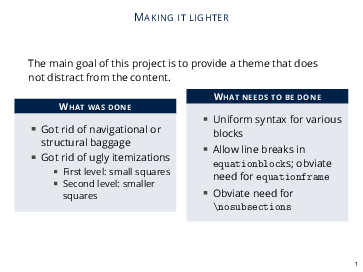
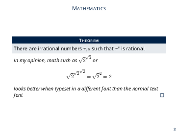
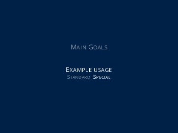

# README #

### What is this repository for? ###

* This repository contains a LaTeX Beamer theme for professional looking presentations with heavy mathematical content.  
* Some example slides:

### How do I get set up? ###

* Download file `beamerthememabeamer.sty` from this repository into your project directory
* Put the command `\usetheme{mabeamer}` in your preamble
* Check `template/template.tex` for example usage of the theme
* If you do not want to copy `beamerthememabeamer.sty` every time you create a new presentation, you may copy it into `<TEXMF>/tex/latex/beamer/base/themes/theme`. The value of `<TEXMF>` depends on your TeX distribution and your operating system, check out http://tex.stackexchange.com/questions/1137/where-do-i-place-my-own-sty-or-cls-files-to-make-them-available-to-all-my-te

### Who do I talk to? ###

* soeren.wolfers@gmail.com

